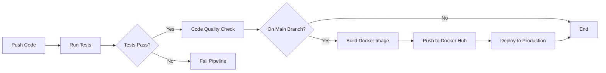

# Testing & CI/CD Documentation

## 📋 Daftar Isi
- [Running Tests](#running-tests)
- [Test Coverage](#test-coverage)
- [CI/CD Pipeline](#cicd-pipeline)
- [GitHub Actions Setup](#github-actions-setup)

## 🧪 Running Tests

### Prerequisites
Pastikan sudah menginstall dependencies:
```bash
composer install
```

### Menjalankan Semua Tests
```bash
vendor/bin/phpunit
```

### Menjalankan Unit Tests Saja
```bash
vendor/bin/phpunit --testsuite unit
```

### Menjalankan Feature Tests Saja
```bash
vendor/bin/phpunit --testsuite feature
```

### Menjalankan Test dengan Coverage
```bash
vendor/bin/phpunit --coverage-html build/coverage
```

Buka `build/coverage/index.html` di browser untuk melihat laporan coverage.

### Menjalankan Test dengan Testdox
```bash
vendor/bin/phpunit --testdox
```

Output akan menampilkan deskripsi test dalam format yang mudah dibaca.

### Menjalankan Specific Test File
```bash
vendor/bin/phpunit tests/unit/UserModelTest.php
```

### Menjalankan Specific Test Method
```bash
vendor/bin/phpunit --filter testCreateUser
```

## 📊 Test Coverage

### Unit Tests
- **UserModel**: Test untuk autentikasi, password hashing, validasi email, dan CRUD operations
- **BookModel**: Test untuk CRUD buku, search, dan relasi dengan users
- **FavoriteModel**: Test untuk toggle favorites, count, dan relasi dengan books

### Feature Tests
- **AuthController**: Test untuk login, register, logout, dan session management
- **BooksController**: Test untuk upload, edit, delete, search, dan favorite books
- **Authorization**: Test untuk admin-only features dan user permissions

### Test Database
Tests menggunakan SQLite in-memory database atau MySQL test database dengan prefix `test_`.

## 🔄 CI/CD Pipeline

### Workflows

#### 1. Tests Workflow (`.github/workflows/tests.yml`)
Berjalan pada setiap push dan pull request.

**Jobs:**
- **Unit Tests**: Test pada PHP 8.1, 8.2, dan 8.3
- **Feature Tests**: Test integrasi dan feature
- **Security Scan**: Check vulnerabilities di dependencies

**Trigger:**
```yaml
on:
  push:
    branches: [ '**' ]
  pull_request:
    branches: [ '**' ]
```

#### 2. CI/CD Workflow (`.github/workflows/ci-cd.yml`)
Full pipeline untuk testing, building, dan deployment.

**Jobs:**
1. **Test**: Run all tests dengan coverage
2. **Lint**: Code quality checks
3. **Build**: Build Docker image dan push ke Docker Hub
4. **Deploy**: Deploy ke production server via SSH

**Trigger:**
```yaml
on:
  push:
    branches: [ main, develop ]
  pull_request:
    branches: [ main, develop ]
```

## ⚙️ GitHub Actions Setup

### Required Secrets

Tambahkan secrets berikut di GitHub Repository Settings → Secrets and variables → Actions:

#### Docker Hub (untuk Build job)
```
DOCKER_USERNAME=your_dockerhub_username
DOCKER_PASSWORD=your_dockerhub_password
```

#### Deployment (untuk Deploy job)
```
SSH_HOST=your_server_ip
SSH_USERNAME=your_server_username
SSH_PRIVATE_KEY=your_ssh_private_key
SSH_PORT=22
DEPLOY_PATH=/path/to/your/app
APP_URL=https://your-app-url.com
```

### Setup Steps

1. **Fork atau Clone Repository**
   ```bash
   git clone https://github.com/yourusername/gositus-home-test.git
   cd gositus-home-test
   ```

2. **Enable GitHub Actions**
   - Buka repository di GitHub
   - Pilih tab "Actions"
   - Klik "I understand my workflows, go ahead and enable them"

3. **Add Secrets**
   - Pergi ke Settings → Secrets and variables → Actions
   - Klik "New repository secret"
   - Tambahkan semua required secrets di atas

4. **Test Pipeline**
   ```bash
   git add .
   git commit -m "test: trigger CI/CD pipeline"
   git push origin main
   ```

5. **Monitor Pipeline**
   - Buka tab "Actions" di GitHub
   - Lihat workflow yang sedang berjalan
   - Klik workflow untuk melihat detail logs

### Pipeline Stages



## 🐳 Docker Testing

### Run Tests in Docker
```bash
docker-compose exec app vendor/bin/phpunit
```

### Run Tests with Coverage in Docker
```bash
docker-compose exec app vendor/bin/phpunit --coverage-text
```

### Create Test Database in Docker
```bash
docker-compose exec db mysql -uroot -proot_password -e "CREATE DATABASE IF NOT EXISTS elibrary_test;"
```

## 📈 Coverage Reports

### Generate HTML Coverage Report
```bash
vendor/bin/phpunit --coverage-html build/coverage
```

### Upload to Codecov (optional)
Tambahkan di `.github/workflows/ci-cd.yml`:
```yaml
- name: Upload coverage to Codecov
  uses: codecov/codecov-action@v4
  with:
    file: ./coverage.xml
    fail_ci_if_error: false
```

Kemudian tambahkan `CODECOV_TOKEN` di GitHub Secrets.

## 🛠️ Troubleshooting

### Test Database Connection Failed
```bash
# Pastikan MySQL service berjalan
docker-compose up -d db

# Atau jalankan tests dengan SQLite
# Edit phpunit.xml.dist, ubah DBDriver ke SQLite
```

### Tests Fail Locally but Pass in CI
```bash
# Clear cache
php spark cache:clear

# Reset database
php spark migrate:refresh --all
php spark db:seed UserSeeder
```

### Permission Issues in Docker
```bash
# Fix permissions
docker-compose exec app chown -R www-data:www-data writable/
docker-compose exec app chmod -R 755 writable/
```

## 📝 Writing New Tests

### Unit Test Example
```php
<?php
namespace Tests\Unit;

use CodeIgniter\Test\CIUnitTestCase;

class MyNewTest extends CIUnitTestCase
{
    public function testSomething()
    {
        $this->assertTrue(true);
    }
}
```

### Feature Test Example
```php
<?php
namespace Tests\Feature;

use CodeIgniter\Test\CIUnitTestCase;
use CodeIgniter\Test\FeatureTestTrait;

class MyFeatureTest extends CIUnitTestCase
{
    use FeatureTestTrait;

    public function testEndpoint()
    {
        $result = $this->get('/api/endpoint');
        $result->assertStatus(200);
    }
}
```

## 🚀 Best Practices

1. **Run tests sebelum commit**
   ```bash
   vendor/bin/phpunit && git commit
   ```

2. **Maintain high coverage** (target: >80%)

3. **Write descriptive test names**
   ```php
   public function testUserCannotAccessAdminArea() { }
   ```

4. **Use database transactions** untuk isolasi tests

5. **Mock external services** di tests

6. **Test edge cases** dan error handling

## 📚 Resources

- [CodeIgniter 4 Testing Documentation](https://codeigniter.com/user_guide/testing/index.html)
- [PHPUnit Documentation](https://phpunit.de/documentation.html)
- [GitHub Actions Documentation](https://docs.github.com/en/actions)
- [Docker Testing Best Practices](https://docs.docker.com/language/php/run-tests/)
